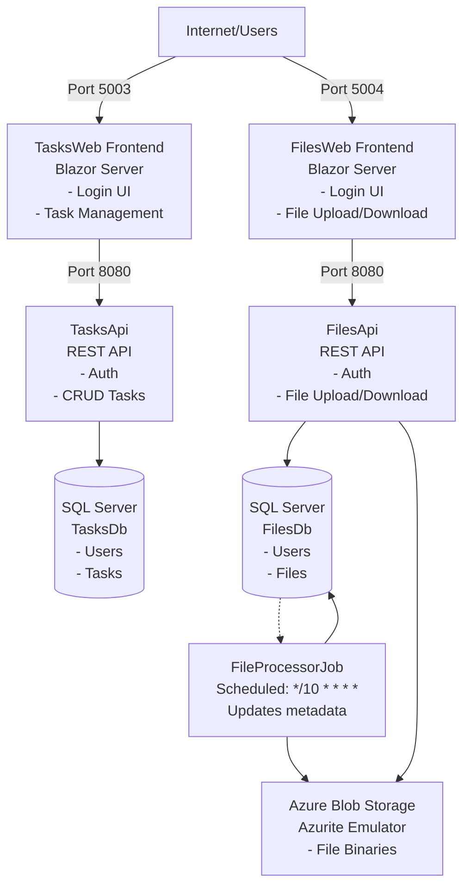
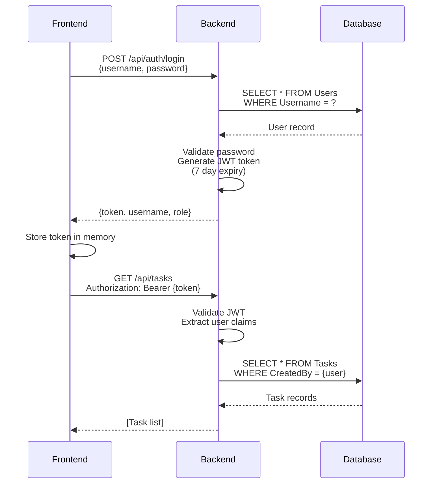
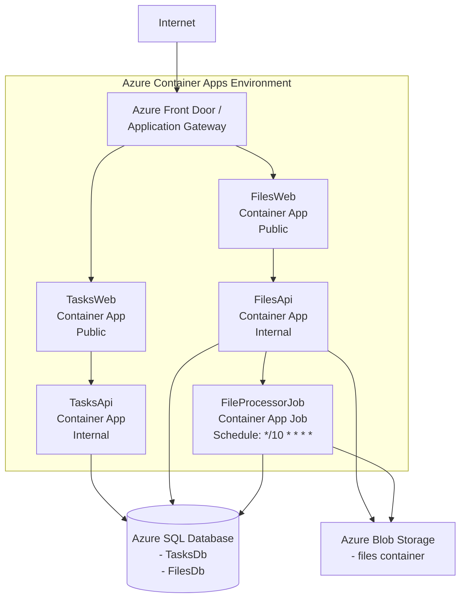

# POC Azure Container Apps - Architecture Documentation

## System Overview

This is a microservices-based proof of concept for Azure Container Apps, consisting of **2 frontend applications**, **2 backend APIs**, and **1 scheduled job** that demonstrate a complete cloud-native application with authentication, database storage, file management, and automated file processing.



---

## Components Detail

### 1. TasksWeb Frontend (Port 5003)

**Technology:** ASP.NET Core 8.0 Blazor Server

**Purpose:** Web application for task management

**Pages:**
- **Home (`/`)**: Landing page with "Get Started" button
- **Login (`/login`)**: User authentication form
- **Tasks (`/tasks`)**: Main task management interface

**Features:**
- ✅ User authentication with JWT tokens
- ✅ Create new tasks
- ✅ View all user's tasks
- ✅ Edit existing tasks
- ✅ Mark tasks as complete/incomplete
- ✅ Delete tasks
- ✅ Real-time UI updates
- ✅ Bootstrap UI with icons

**Services:**
- `AuthService`: Handles login/logout and token management
- `TasksApiClient`: HTTP client for calling TasksApi endpoints

**Data Flow:**
1. User fills login form → POST to TasksApi `/api/auth/login`
2. Receives JWT token → Stores in memory
3. All subsequent requests include `Authorization: Bearer {token}` header
4. CRUD operations call TasksApi with authenticated requests

---

### 2. FilesWeb Frontend (Port 5004)

**Technology:** ASP.NET Core 8.0 Blazor Server

**Purpose:** Web application for file management

**Pages:**
- **Home (`/`)**: Landing page with "Get Started" button
- **Login (`/login`)**: User authentication form
- **Files (`/files`)**: File management interface

**Features:**
- ✅ User authentication with JWT tokens
- ✅ Upload files (up to 10MB)
- ✅ View file list with metadata (name, size, type, date)
- ✅ Download files
- ✅ Delete files
- ✅ File size formatting (B, KB, MB, GB)
- ✅ Bootstrap table UI

**Services:**
- `AuthService`: Handles login/logout and token management
- `FilesApiClient`: HTTP client for calling FilesApi endpoints

**Data Flow:**
1. User logs in → POST to FilesApi `/api/auth/login`
2. Receives JWT token → Stores in memory
3. File upload → Sends multipart/form-data to FilesApi
4. FilesApi stores binary in Azure Blob Storage + metadata in SQL
5. Download → Retrieves file from Blob Storage via FilesApi
6. JavaScript helper triggers browser download

---

### 3. TasksApi Backend (Port 5001 → Internal 8080)

**Technology:** ASP.NET Core 8.0 Web API

**Purpose:** RESTful API for task operations and authentication

**Database:** SQL Server - `TasksDb`
- **Users Table**: Id, Username, Email, PasswordHash, Role, CreatedAt
- **Tasks Table**: Id, Title, Description, IsCompleted, CreatedBy, CreatedAt

**Endpoints:**

#### Authentication
- `POST /api/auth/login`
  - Input: `{ username, password }`
  - Output: `{ token, username, role }`
  - Logic: Validates credentials → Generates JWT token

#### Tasks
- `GET /api/tasks` - Get all tasks for authenticated user
- `GET /api/tasks/{id}` - Get specific task
- `POST /api/tasks` - Create new task
  - Input: `{ title, description, isCompleted }`
  - Auto-assigns `createdBy` from JWT claims
- `PUT /api/tasks/{id}` - Update task
- `DELETE /api/tasks/{id}` - Delete task

**Security:**
- JWT Bearer token authentication
- `[Authorize]` attribute on all task endpoints
- User isolation: Tasks filtered by `CreatedBy` claim from token

**Key Services:**
- `AuthService`: Login logic and JWT generation
- `TasksDbContext`: Entity Framework Core database context

**Startup Logic:**
1. Applies EF Core migrations automatically on container start
2. Seeds demo users (demo, admin, user)
3. Configures JWT authentication middleware
4. Enables CORS for frontend access

---

### 4. FilesApi Backend (Port 5002 → Internal 8080)

**Technology:** ASP.NET Core 8.0 Web API

**Purpose:** RESTful API for file operations and authentication

**Database:** SQL Server - `FilesDb`
- **Users Table**: Id, Username, Email, PasswordHash, Role, CreatedAt
- **Files Table**: Id, FileName, BlobName, ContentType, FileSize, UploadedBy, UploadedAt

**Storage:** Azure Blob Storage (Azurite emulator in development)
- Container: `files`
- Stores actual file binaries
- Metadata stored in SQL database

**Endpoints:**

#### Authentication
- `POST /api/auth/login`
  - Input: `{ username, password }`
  - Output: `{ token, username, role }`

#### Files
- `GET /api/files` - List all files for authenticated user
- `POST /api/files/upload` - Upload file
  - Input: Multipart form data with file
  - Logic: 
    1. Validates file
    2. Generates unique blob name (GUID)
    3. Uploads to Azure Blob Storage
    4. Saves metadata to SQL
  - Returns: File metadata
- `GET /api/files/{id}/download` - Download file
  - Logic:
    1. Gets metadata from SQL
    2. Retrieves file from Blob Storage
    3. Returns file stream
- `DELETE /api/files/{id}` - Delete file
  - Logic:
    1. Deletes blob from storage
    2. Removes metadata from SQL

**Security:**
- JWT Bearer token authentication
- `[Authorize]` attribute on all file endpoints
- User isolation: Files filtered by `UploadedBy` claim

**Key Services:**
- `AuthService`: Login logic and JWT generation
- `BlobStorageService`: Azure Blob Storage operations
- `FilesDbContext`: Entity Framework Core database context

**Startup Logic:**
1. Applies EF Core migrations automatically
2. Seeds demo users (same as TasksApi)
3. Configures JWT authentication
4. Initializes Blob Storage client

---

### 5. FileProcessorJob (Container App Job)

**Technology:** .NET 8.0 Console Application

**Purpose:** Scheduled job that processes uploaded files automatically

**Schedule:** Runs every 10 minutes (cron: `*/10 * * * *`)

**Database:** SQL Server - `FilesDb` (shared with FilesApi)
- Reads/Updates **Files Table** metadata

**Storage:** Azure Blob Storage (same container as FilesApi)
- Container: `files`
- Reads and modifies file binaries

**Processing Logic:**
1. Lists all blobs in the `files` container
2. Filters out files already processed (containing `-processed` suffix)
3. For each unprocessed file:
   - Generates new name: `{original-name}-processed-{timestamp}.{ext}`
   - Copies blob to new name
   - Deletes original blob
   - Updates metadata in FilesDb:
     - `BlobName` → new processed blob name
     - `FileName` → new processed filename (visible to users)
4. Logs processed count and skipped count

**Key Services:**
- `BlobServiceClient`: Azure Storage SDK for blob operations
- `FilesDbContext`: Entity Framework Core for database updates
- `ILogger`: Structured logging with timestamps

**Environment Configuration:**
- `AzureStorage__ConnectionString`: Storage account connection
- `AzureStorage__ContainerName`: Target container (default: "files")
- `ConnectionStrings__DefaultConnection`: SQL Server connection

**Execution Modes:**
- **Azure**: Automated via Container App Job (cron schedule)
- **Local Development**: Manual execution via `docker-compose run --rm file-processor-job`

**Error Handling:**
- Logs warnings if file metadata not found in database
- Continues processing other files if one fails
- Exit code 1 on critical errors

---

## Authentication Flow



---

## Data Models

### User
```csharp
{
    Id: int                    // Primary key
    Username: string           // Unique, max 50 chars
    Email: string              // Unique, max 100 chars
    PasswordHash: string       // Hashed password (BCrypt format for demo)
    Role: string               // "User" or "Admin"
    CreatedAt: DateTime        // Registration timestamp
}
```

### Task
```csharp
{
    Id: int                    // Primary key
    Title: string              // Required, max 200 chars
    Description: string        // Optional, max 1000 chars
    IsCompleted: bool          // Task status
    CreatedBy: string          // Username of creator
    CreatedAt: DateTime        // Creation timestamp
}
```

### FileMetadata
```csharp
{
    Id: int                    // Primary key
    FileName: string           // Original filename, max 255 chars
    BlobName: string           // Unique blob identifier (GUID)
    ContentType: string        // MIME type (e.g., "image/png")
    FileSize: long             // Size in bytes
    UploadedBy: string         // Username of uploader
    UploadedAt: DateTime       // Upload timestamp
}
```

---

## Technology Stack

### Frontend
- **Framework**: ASP.NET Core 8.0 Blazor Server
- **UI**: Bootstrap 5 + Bootstrap Icons
- **Rendering**: Interactive Server mode (WebSocket connection)
- **HTTP Client**: Built-in HttpClient with typed clients

### Backend
- **Framework**: ASP.NET Core 8.0 Web API
- **ORM**: Entity Framework Core 8.0
- **Database**: SQL Server (Azure SQL Edge for ARM64 compatibility)
- **Authentication**: JWT Bearer tokens (7-day expiry)
- **Storage**: Azure Blob Storage SDK (Azurite for local dev)
- **API Documentation**: Swagger/OpenAPI

### Scheduled Jobs
- **Framework**: .NET 8.0 Console Application
- **ORM**: Entity Framework Core 8.0 (shared DbContext)
- **Storage SDK**: Azure.Storage.Blobs 12.27.0
- **Logging**: Microsoft.Extensions.Logging.Console
- **Scheduling**: Azure Container Apps Jobs with cron expressions

### Infrastructure
- **Containerization**: Docker + Docker Compose
- **Database**: Azure SQL Edge (localhost:1433)
- **Blob Storage**: Azurite emulator (localhost:10000)
- **Networking**: Docker bridge network
- **Cloud Platform**: Azure Container Apps (for production)

---

## Security Considerations

### Current Implementation (POC/Demo)
- ⚠️ **Passwords**: Simple validation with hardcoded mapping (demo/Redistributing}5{{6%, etc.)
- ⚠️ **Password Hashing**: BCrypt hashes in database but not validated (placeholder)
- ⚠️ **HTTPS**: Disabled in Docker containers (HTTP only)
- ⚠️ **Secrets**: JWT secret in configuration (not externalized)

### Production Recommendations
- ✅ Use proper password hashing with BCrypt.Net-Next library
- ✅ Enable HTTPS with valid certificates
- ✅ Store secrets in Azure Key Vault
- ✅ Implement password policies (complexity, expiry)
- ✅ Add rate limiting on authentication endpoints
- ✅ Implement refresh tokens for JWT
- ✅ Add audit logging for sensitive operations
- ✅ Use Azure Managed Identity for service-to-service auth
- ✅ Implement RBAC (Role-Based Access Control)
- ✅ Add CORS restrictions for production domains

---

## Deployment Architecture (Azure Container Apps)

When deployed to Azure, the architecture maps to:



**Azure Resources Required:**
1. **Container Apps Environment**: Hosts all 4 container apps + 1 job
2. **Azure Container Registry (ACR)**: Stores Docker images
3. **Azure SQL Database**: Two databases (TasksDb, FilesDb)
4. **Azure Storage Account**: Blob storage for files
5. **Application Insights**: Monitoring and diagnostics
6. **Azure Key Vault**: Secrets management (recommended)
7. **Managed Identity**: Service authentication (recommended)

**Bicep IaC**: 
- Infrastructure: `/srcs/infrastructure/main-infra.bicep` (base resources)
- Applications: `/srcs/infrastructure/main-apps.bicep` (container apps + job)

---

## Local Development URLs

- **TasksWeb**: http://localhost:5003
- **FilesWeb**: http://localhost:5004
- **TasksApi Swagger**: http://localhost:5001/swagger
- **FilesApi Swagger**: http://localhost:5002/swagger
- **SQL Server**: localhost:1433 (sa / P@ssw0rd123!)
- **Azurite Blob**: localhost:10000

**Demo Credentials:**
- demo / Redistributing}5{{6%
- admin / Preimitation{7{!3#
- user / Chronoscopically$0/(8.

---

## Key Concepts Demonstrated

1. **Microservices Architecture**: Independent services with separate databases (database-per-service pattern)
2. **JWT Authentication**: Stateless authentication with token-based security
3. **RESTful APIs**: Standard HTTP methods (GET, POST, PUT, DELETE)
4. **Scheduled Jobs**: Container App Jobs with cron scheduling for automated processing
5. **Event-Driven Processing**: Automated file processing workflow
4. **Blazor Server**: Real-time UI with SignalR WebSocket connection
5. **Entity Framework Core**: Code-first database with migrations
6. **Azure Blob Storage**: Decoupled file storage from metadata
7. **Docker Compose**: Multi-container orchestration for local development
8. **Infrastructure as Code**: Bicep templates for Azure deployment
9. **Containerization**: Dockerfile multi-stage builds
10. **API Documentation**: Swagger/OpenAPI specifications
